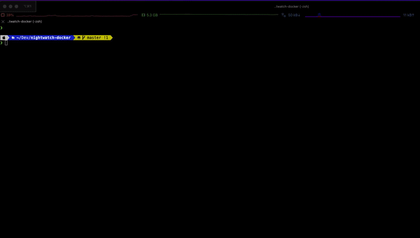

# nightwatch-docker

[](https://github.com/vaibhavsingh97/nightwatch-docker/actions/workflows/workflow.yml)

Docker setup with screen recording support for [Nightwatch][NightwatchLink] containerized versions of Chrome, Firefox and Edge on Linux.



# 🚀 Quick Start

1. Clone this repo
2. Start a docker container using Firefox

   ```sh
   docker run -d -p 4444:4444 --shm-size="2g" selenium/standalone-firefox
   ```

3. Make sure `Nightwatch.conf.js` has `start_process` to `false`.

4. Run `npx nightwatch` to run nightwatch tests in Firefox browser.
5. 🎉 You have just successfully run your first tests in the Firefox browser.

☝️ When executing docker run for an image that contains a browser please use the flag `--shm-size=2g` to use the host's shared memory.

# ⚙️ Usage

There are two ways a user can run tests with Nightwatch using docker

1. ## Using Docker images (As shown in quick start)

   We can use different docker images to start different containers for different browsers.

   ```sh
   docker run -d -p 4444:4444 --shm-size="2g" selenium/standalone-<firefox/chrome/edge>
   ```

   ⚠️ Only one docker container can be run at a time, as port will conflict.

   ### Video Recording

   Tests execution can be recorded by using the `selenium/video` Docker image. One container is needed per each container where a browser is running. This means if you are running 5 Nodes/Standalone containers, you will need 5 video containers, the mapping is 1-1.

   Currently, the only way to do this mapping is manually (either starting the containers manually, or through docker-compose).

   ```sh
   $ docker network create grid
   $ docker run -d -p 4444:4444 -p 6900:5900 --net grid --name firefox --shm-size="2g" selenium/standalone-firefox
   $ docker run -d --net grid --name video -v $(pwd)/videos:/videos selenium/video
   $ npx nightwatch
   $ docker stop video && docker rm video
   $ docker stop firefox && docker rm firefox
   ```

2. ## Using Docker compose

   ### ![Chrome][ChromeImage] Chrome

   ```sh
   docker-compose -f docker-compose.chrome.yml up --exit-code-from nightwatch
   ```

   ### ![Firefox][FirefoxImage] Firefox

   ```sh
   docker-compose -f docker-compose.firefox.yml up --exit-code-from nightwatch
   ```

   ### ![Edge][EdgeImage] Edge

   ```sh
   docker-compose -f docker-compose.edge.yml up --exit-code-from nightwatch
   ```

   ### Selenium Hub

   ```sh
   docker-compose -f docker-compose.selenium-hub.yml up --exit-code-from nightwatch
   ```

   Stop and remove container set:

   ```sh
   docker-compose -f docker-compose.<service-name>.yml down
   ```
   > service-name would be from either of these `chrome/firefox/edge/selenium-hub`

## 🐛 Issues

Issues with this nightwatch-docker can filed [here](https://github.com/nightwatchjs/nightwatch-docker/issues)

[NightwatchLink]:https://nightwatchjs.org/
[ChromeImage]:https://raw.githubusercontent.com/alrra/browser-logos/main/src/chrome/chrome_24x24.png
[FirefoxImage]:https://raw.githubusercontent.com/alrra/browser-logos/main/src/firefox/firefox_24x24.png
[EdgeImage]:https://raw.githubusercontent.com/alrra/browser-logos/main/src/edge/edge_24x24.png
